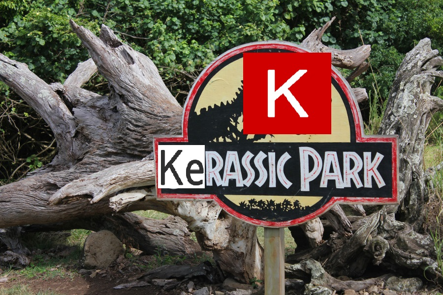

	
	 
	 
	 

	<a href="#">Kerasic Park</a>&nbsp;&nbsp;&nbsp;
	<a href="#">Contribution guide</a>&nbsp;&nbsp;&nbsp;
	<a href="#">Weight Files</a>

 

	<b>Contribute by adding a new model in the list.</b>

 

## Contents

- [Image Classification](#image-classification)
- [Image Captioning](#image-captioning)
- [Object Detection](#object-detection)
- [Video Classification](#video-classification)
- [Style Transfer](#style-transfer)
- [Bio-signal](#bio-signal)
- [Medical Image Analysis](#medical-image-analysis)
- [NLP](#nlp)
- [Speech](#speech)

## Image Classification

- [Keras Application](https://keras.io/applications/) - Keras Pre-trained Models.
	- [Xception](https://keras.io/applications/#xception) - Xception.

## Image Captioning

## Object Detection

## Video Classification

## Style Transfer

## Bio-signal

## Medical Image Analysis

## NLP

## Speech

## Similar

- [Keras Model Zoo](https://github.com/albertomontesg/keras-model-zoo) - Search the Awesome dataset.
- [Keras Application Zoo](https://github.com/GKalliatakis/Keras-Application-Zoo) - Quick search for Awesome lists.

## Credits

- [Awesome](https://github.com/sindresorhus/awesome) - Templates.

## License

